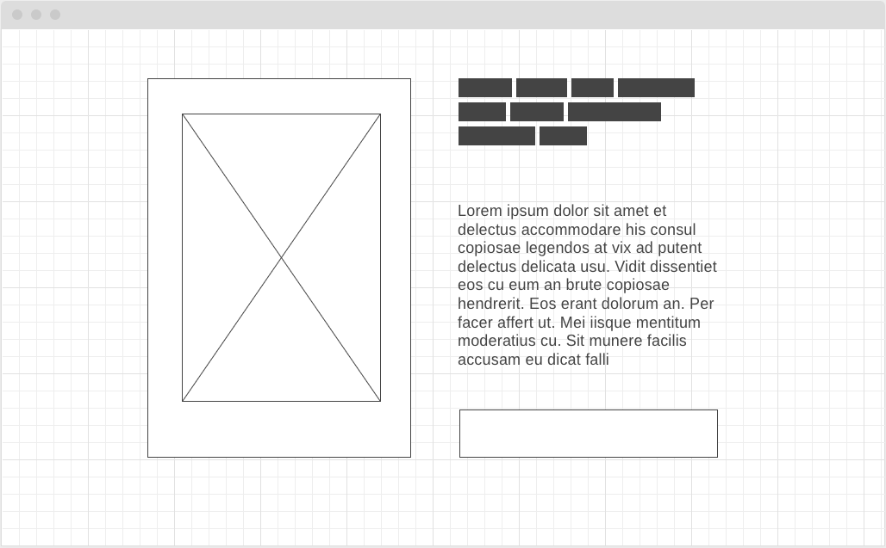
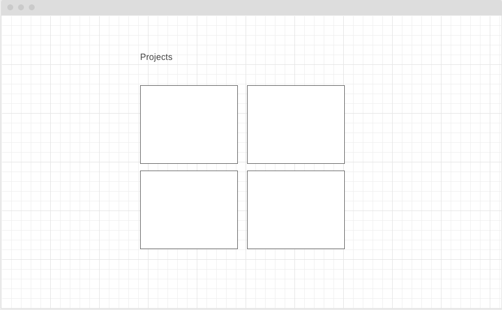
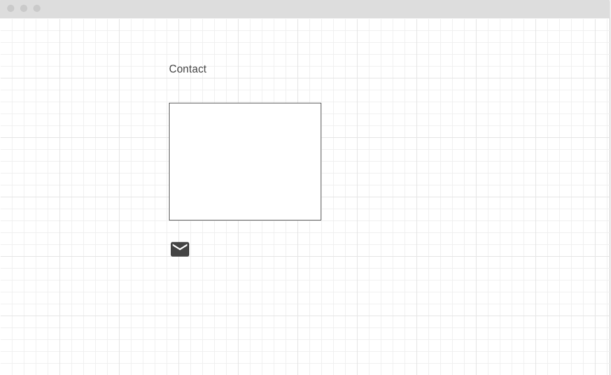

# My Portfolio 

##
### Site: [https://jibelais.github.io/Portfolio/](https://jibelais.github.io/Portfolio/)

## Contents

* **Main**
	1. Personal statement 

* **About Me**
	1. Technical skills
	2. Soft kills
* **Projects**
	1. Project placeholders
* **Contact**
	1. Icon to link email, social media, github

## Project Schedule

|  Day | Deliverable | Status
|---|---| ---|
|Day 1| Project Description | completed
|Day 2| Wireframes / Priority Matrix / Timeline | completed
|Day 3| Core Application Structure (HTML, CSS, etc.) | completed
|Day 4| MVP & Bug Fixes | completed
|Day 5| Final Touches | completed
|Day 6| Present | Incomplete

## Wireframes

 

## Time/Priority Matrix 

#### MVP
| Component | Priority | Estimated Time | Actual Time |
| --- | :---: |  :---: | :---: | 
| Main Navigation | H | 2hr | hr |
| Project Previews | H | 3hr | hr |
| Working with API | H | 2hr|  hr | 
| Layout and flex| M | 4hr | hr|
| Responsive | H | 3hr | hr | hr |
| Social Media Icons | L | 1hr |  hr |
| Total | H | 15 hrs| hrs |

#### PostMVP
| Component | Priority | Estimated Time | Actual Time |
| --- | :---: |  :---: | :---: | 
| Special effect on project preview | L | 4hr | -hr | hr |
| Animated introdction  | L | 5hr | hr |
| CSS Touch up | M | 2hr | hr |
| Total | H | 11hrs| hrs |

## Issues and Resolutions
*The folder structure caused broken links after deploying to gibhub pages.  To work-around, the folder structure has been removed, not final solution. 

*Project preview has some layout issue.  It's deliverable for now, but it needs better solution. 

 